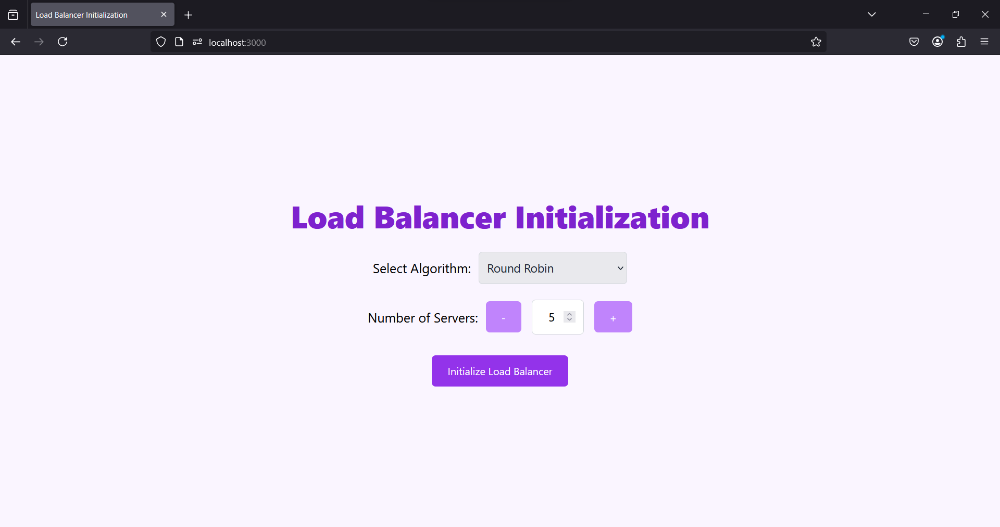
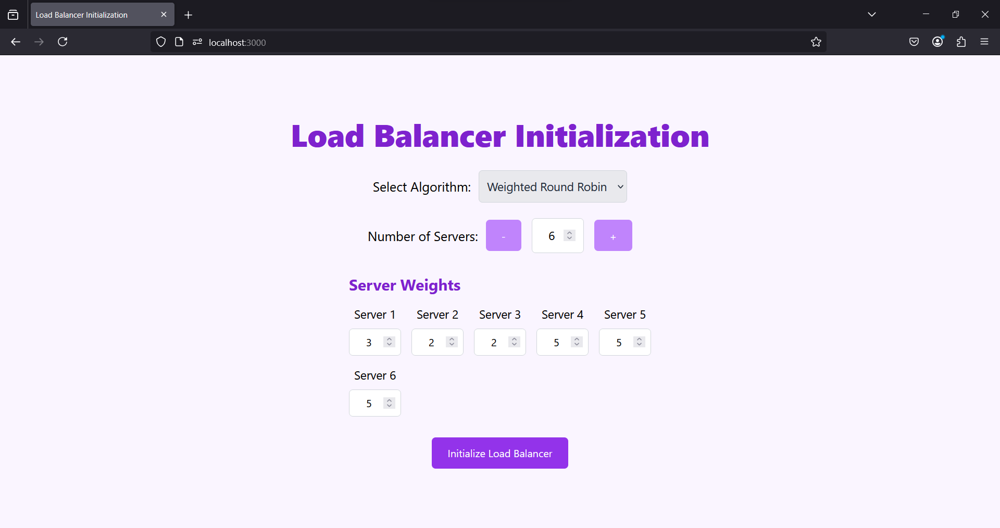
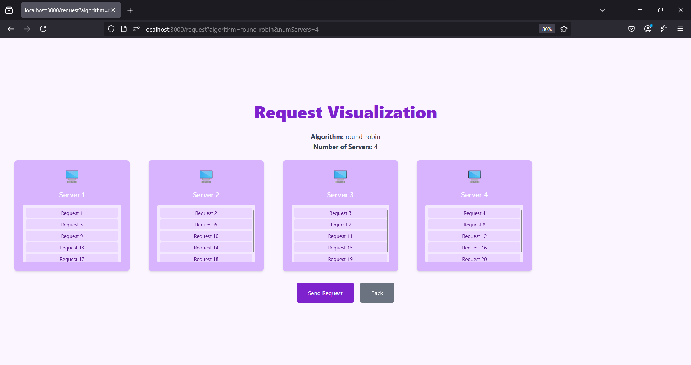
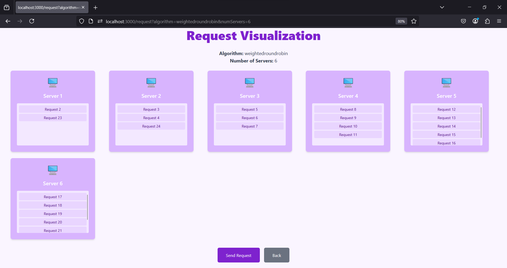
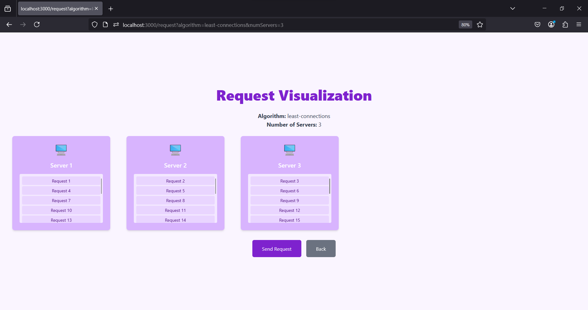

# Load-Balancer-Visulization
Load Balancer Visulization

This project demonstrates various load balancing algorithms through backend simulations and an interactive frontend visualization. The goal is to help students and developers understand how load balancing techniques work in a system design context.

---

## Introduction
Load balancing is a critical concept in system design for distributing client requests or network traffic across multiple servers. It prevents any single server from being overloaded, thereby improving system performance and reliability.

With this project, you can simulate and visualize four common load balancing algorithms:
1. **Round Robin Algorithm**
2. **Weighted Round Robin Algorithm**
3. **Least Connections Algorithm**

### 🏠 Home Page
The landing page where users can select different load balancing algorithms to visualize.

---

### ⚙️ Initialization Screen
Configure your simulation:
- Set the number of servers.
- Define server weights (for Weighted Round Robin).
- Enter client requests.

---

### 🔄 Round Robin Algorithm Visualization
Requests are evenly distributed across all servers in a round-robin fashion.

---

### ⚖️ Weighted Round Robin Algorithm Visualization
Servers with higher weights handle a proportionally larger number of requests.

---

### 📉 Least Connections Algorithm Visualization
Requests are assigned to the server with the fewest active connections in real-time.

---

## Features
- Customizable number of servers and weights for weighted algorithms.
-  Interactive visualizations for each algorithm.
- Real-time representation of request distribution.
- Web-based visualization (Next.js).

---

## Tech Stack
### Backend:
- Java (Core logic and simulations)
- Spring Boot (for serving API endpoints)

### Frontend:
- Next.js (for interactive visualization)
- Tailwind CSS (for modern UI components)

### Tools:
- Git (Version control)

